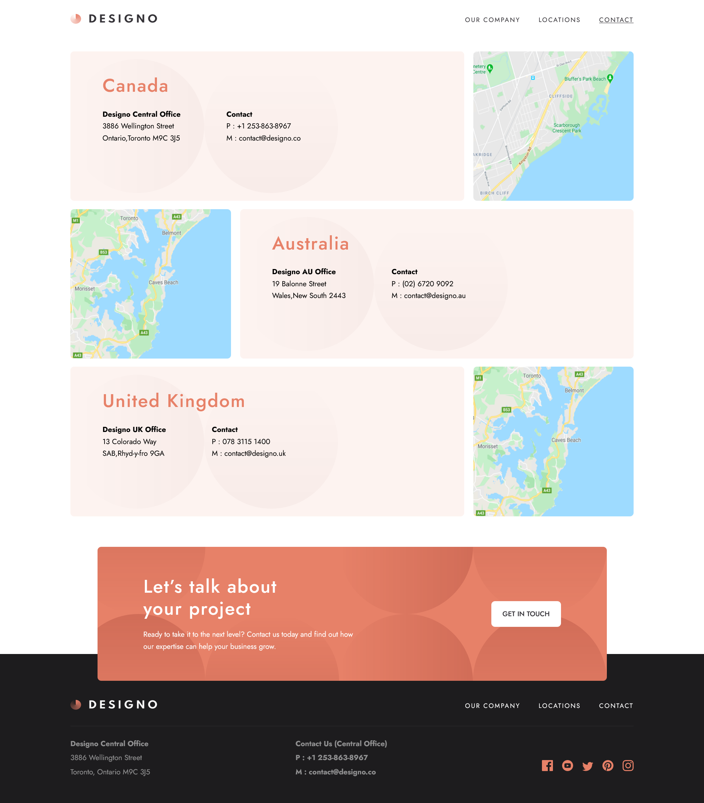
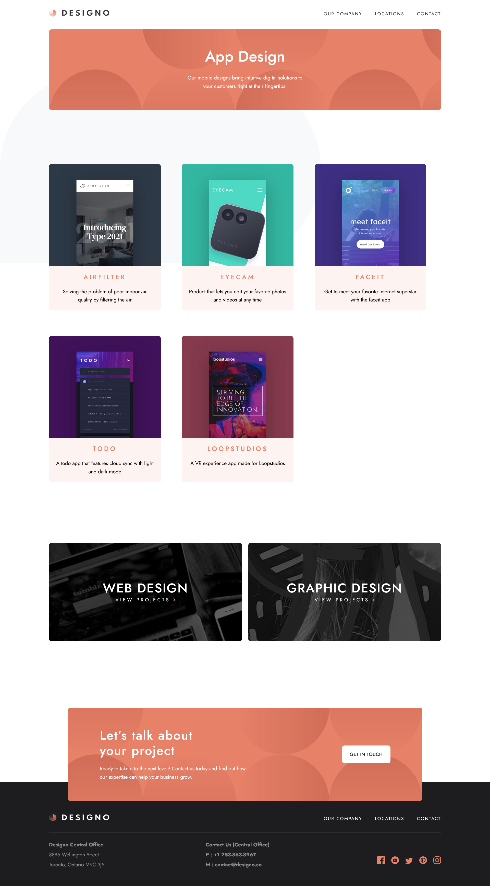

# Frontend Mentor - Designo agency website solution

This is a solution to the [Designo agency website challenge on Frontend Mentor](https://www.frontendmentor.io/challenges/designo-multipage-website-G48K6rfUT). Frontend Mentor challenges help you improve your coding skills by building realistic projects.

## Table of contents

- [Overview](#overview)
  - [The challenge](#the-challenge)
  - [Screenshot](#screenshot)
  - [Links](#links)
- [My process](#my-process)
  - [Built with](#built-with)
  - [Continued development](#continued-development)
  - [Useful resources](#useful-resources)
- [Author](#author)

## Overview

### The challenge

Users should be able to:

- View the optimal layout for each page depending on their device's screen size
- See hover states for all interactive elements throughout the site
- Receive an error message when the contact form is submitted if: (not yet implemented)
  - The `Name`, `Email Address` or `Your Message` fields are empty should show "Can't be empty"
  - The `Email Address` is not formatted correctly should show "Please use a valid email address"
- **Bonus**: View actual locations on the locations page maps (we recommend [Leaflet JS](https://leafletjs.com/) for this)

### Screenshot

### Links

- Solution URL: [https://www.frontendmentor.io/solutions/designo-vuejs-multipage-website-bIP0gxp8bh](https://www.frontendmentor.io/solutions/designo-vuejs-multipage-website-bIP0gxp8bh)
- Live Site URL: [https://zolfikaar.github.io/Designo-vuejs/](https://zolfikaar.github.io/Designo-vuejs/)

## My process

### Built with

- Semantic HTML5 markup
- CSS custom properties
- Flexbox
- CSS Grid
- Mobile-first workflow
- [Vue.js](https://vuejs.org/)

### Continued development

I'll keep trying with the form problem till meet the required task

### Useful resources

- [cssgrid generator](https://cssgrid-generator.netlify.app/)

## Author

- Frontend Mentor - [@Zolfikaar](https://www.frontendmentor.io/profile/Zolfikaar)
